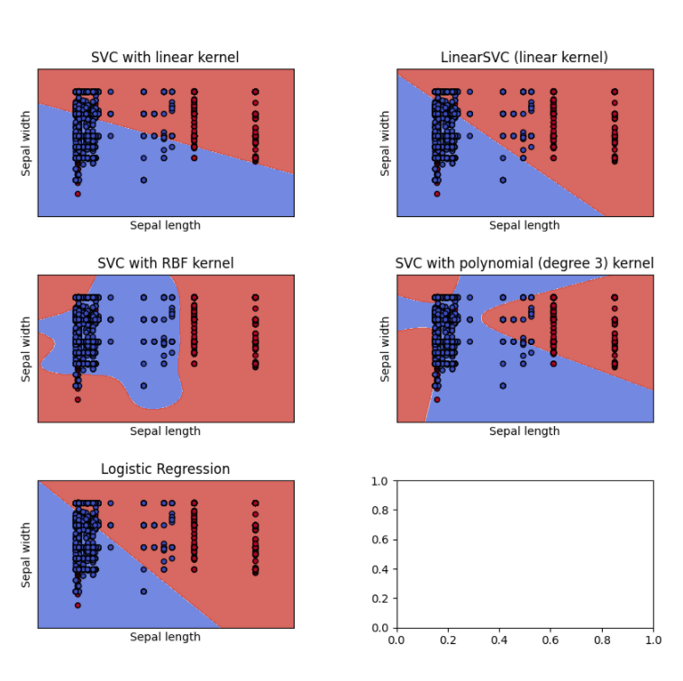

# Classificació Binària de 17.7K cançons Angleses d'entre el 2008 i 2017
Linck:[kaggle] https://www.kaggle.com/rashikrahmanpritom/177k-english-song-data-from-20082017

(Aquest document a estat generat a partir de **Codi.ipynb** on trobareu tot el codi utilitzat)
## Objectiu
Poder classificar cançons entre els estils (Gèneres) de Rock i de Hip-Hop

## Introducció
En aquest document trobareu els resultats generats per fer un aprenentatge computacional de classificació i analitzarem els següents punts:
```
Analitzar les dades de més de 17.000 cançons
Netejar les dades incompletes o innecessàries de 21 atributs.
Identificar els atributs rellevants i l'atribut objectiu
Manipular dades no numèriques per poder visualitzar possibles correlacions
Comprovar els beneficis de balancejar les dades
Analitzar diferents models de classificació
Diferenciar cançons entre Rock i Hip-Hop.
```
## Experiments
Com el fet de balancejar les dades ens permet tenir una millor classificació.

Com la utilització de models ensemble no sempre provoca millors classificacions.

Com la utilització de diferents atributs afecta la classificació.

### Preprocessat
Balancejar les dades ens permet tenir una millor classificació, ja que ens evita el problema de provocar falsos positius/negatius amb poc pes.

L'eliminació de dades nul·les o atributs irrellevants que podrien distreure'ns a l'hora de seleccionar els atributs rellevants.

La modificació d'atributs de tipus String a Int per poder utilitzar-los en les correlacions i en la generació de models generats.


## Anàlisis de models de Classificació
Ara que ja tenim el nostre Dataset només amb els atributs que volem, provarem de gènera unes classificacions Logística i SVM amb diferents conjunts d'aprenentatge i test per veure el tant per cent de classificació correcte que podem obtenir amb aquests mètodes.

(El mètode SVM, l'utilitzarem amb el tipus de kernel 'rpf')


    Correct classification Logistic  0.5 % of the data:  0.7043918918918919
    Correct classification SVM       0.5 % of the data:  0.7730855855855856
    Correct classification Logistic  0.7 % of the data:  0.6937148217636022
    Correct classification SVM       0.7 % of the data:  0.7650093808630394
    Correct classification Logistic  0.8 % of the data:  0.7065446868402533
    Correct classification SVM       0.8 % of the data:  0.796622097114708
    

Observem que utilitzar els mètodes d'hiperplans, obtenim una millor classificació, aixi que intentarem provar diferents kernels amb el mètode SVM per veure les diferents generacions de classificacions que poden produir i seleccionarem els que ens doni una major taxa de classificació correcte.



Com podem veure, les classificacions lineals sembla que no són les més indicades, en canvi les que compten amb una Lambda (Λ) major, ens generen una classificació més encertada. Tot i això i per asseguren-se, també generarem un rànquing amb els mètodes segons el seu radi d'encert amb la classificació.


<table id="T_c00bb_">
  <thead>
    <tr>
      <th class="blank level0" >&nbsp;</th>
      <th class="col_heading level0 col0" >model</th>
      <th class="col_heading level0 col1" >cv_score</th>
    </tr>
  </thead>
  <tbody>
    <tr>
      <th id="T_c00bb_level0_row0" class="row_heading level0 row0" >3</th>
      <td id="T_c00bb_row0_col0" class="data row0 col0" >SVC(kernel='linear')</td>
      <td id="T_c00bb_row0_col1" class="data row0 col1" >0.577777</td>
    </tr>
    <tr>
      <th id="T_c00bb_level0_row1" class="row_heading level0 row1" >4</th>
      <td id="T_c00bb_row1_col0" class="data row1 col0" >LinearSVC()</td>
      <td id="T_c00bb_row1_col1" class="data row1 col1" >0.702777</td>
    </tr>
    <tr>
      <th id="T_c00bb_level0_row2" class="row_heading level0 row2" >2</th>
      <td id="T_c00bb_row2_col0" class="data row2 col0" >LogisticRegression()</td>
      <td id="T_c00bb_row2_col1" class="data row2 col1" >0.704999</td>
    </tr>
    <tr>
      <th id="T_c00bb_level0_row3" class="row_heading level0 row3" >1</th>
      <td id="T_c00bb_row3_col0" class="data row3 col0" >SVC(kernel='poly')</td>
      <td id="T_c00bb_row3_col1" class="data row3 col1" >0.723148</td>
    </tr>
    <tr>
      <th id="T_c00bb_level0_row4" class="row_heading level0 row4" >0</th>
      <td id="T_c00bb_row4_col0" class="data row4 col0" >SVC()</td>
      <td id="T_c00bb_row4_col1" class="data row4 col1" >0.766667</td>
    </tr>
  </tbody>
</table>


Observan aquesta taula, valem que el mètode de classificació amb una major tassa d'encerts és el SVM amb el kernels de tipus 'rpf', seguit per al SVM amb els kernels de tipus polinomial.
A més a més, veiem que el model de classificació Logística dona millors resultats que els models SVM lineals.

## Conclusions
Hem pogut veure com el balanceja les dades ens serveix per no generar classificacions errònies.

Hem vist també, que els atributs amb major importància són 'genres_all', 'bit_rate' i 'genres'.

També hem sigut capaços de generar una classificació del 76,7% utilitzant els atributs 'genres_all' i 'bit_rate', amb el model SVM(rpf).

Hem vist que és possible generar classificacions només utilitzant l'atribut 'genres_all', però que té altra probabilitat de ser culpa d'un sobreentrenament de les dades.

## Idees per treballar en un futur

Podem utilitzar altres formes per extreure la informació dels atributs 'genres_all' i 'genres', i seleccionar o agrupar les dades més importants.

Podem canviar la forme de balancejar les dades, utilitzant tot el dataset i assignant a la classe 'hip-hop' major pes per visualitzar la classificació amb tota la BBDD.

Podem profunditzar amb el model SVM amb els kernels de tipus 'rpf' per utilitzar els paràmetres de forma més òptima.

Podríem segui intenten genera un millor classificador si som capaços d'especificar un segon atribut el qual dispersi les dades més agrupades.
